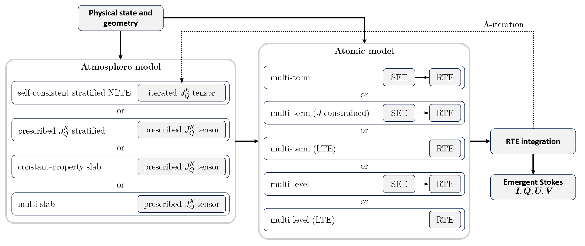

# SolRaT 

[](https://solrat.readthedocs.io/latest/)
[](https://www.yakovkinii.com/solrat/)

[](https://pypi.org/project/solrat)


[](https://coveralls.io/github/yakovkinii/SolRaT?branch=master)

SolRaT (Solar Radiative Transfer) is a forward-modeling code for the polarized, non-LTE
transfer of spectral-line radiation in magnetized stellar atmospheres. It is built on the
density-matrix formalism of [[LL04](#References)] and written so that each statistical-equilibrium
and radiative-transfer expression reads close to the equation it implements. The aim is a
model that is transparent enough to inspect and verify, and flexible enough to adapt to a
specific line or context rather than used as a black box.

Manuscript figure and benchmark demos are mapped in [README_MANUSCRIPT.md](README_MANUSCRIPT.md).

#### Physical model
- **Density-matrix formalism** in the irreducible spherical statistical tensors $\rho^K_Q$,
with atomic level polarization fully included [[LL04](#References)].
- **Interchangeable atomic models** in a single pipeline: multi-term, multi-level, and LTE
variants of both descriptions, selectable without rewriting the surrounding code.
- **Magnetic fields across regimes**: Hanle physics at weak fields, linear Zeeman splitting in
the multi-level atom, and linear Zeeman through incomplete and complete Paschen-Back splitting
in the multi-term atom by exact diagonalization of the atomic Hamiltonian.
- **Radiation field** $J^K_Q$ either prescribed (LTE Planck, or Allen/ATL08-style anisotropic
$\{n, w\}$ values for coronal/chromospheric lines) or solved self-consistently for the
non-LTE scattering problem [[TM99](#References)].

#### Atmospheres and synthesis
- **Constant-property slabs**, optionally stacked into a multi-slab stratification under
anisotropic illumination.
- **Height-stratified atmospheres** in which temperature, absorber number density, the
magnetic-field vector, microturbulence, Voigt damping, and the vector macroscopic velocity
vary continuously with geometric height. The radiation tensor $J^K_Q$ can be prescribed on
the depth grid or solved self-consistently by $\Lambda$-iteration, with the Stokes transfer
solved by the DELO method.
- Emergent Stokes profiles for a chosen line of sight at arbitrary spectral resolution.

#### Design
SolRaT is organized in three layers:
- a **public API** to run the built-in models;
- a **modeling API** to extend a model or build a new one by analogy with the shipped ones;
- the **SolRaT engine**, a vectorized meta-language in which the angular algebra and rate
expressions are written close to their mathematical form, with the bookkeeping and
optimization handled underneath.

<p align="center">
  
</p>
<p align="center"><small>The synthesis flow separates the atmosphere choice, the atomic description, the radiation-field treatment, and the final RTE integration; in self-consistent non-LTE runs the formal solution feeds back into the radiation tensor used by the SEE.</small></p>
<p align="center"><small>Figure from Yakovkin (2026), <a href="https://arxiv.org/abs/2609.32850">arXiv:2609.32850</a>, licensed under <a href="https://creativecommons.org/licenses/by/4.0/">CC BY 4.0</a>.</small></p>

Pre-configured atomic data include He I D3 in multi-term and multi-level forms, and
LTE-oriented multi-term models for Mn I 5432.5 &Aring;, Ni I 5435.9 &Aring;, and Fe I 5434.523 &Aring;.

#### Scope and limitations
SolRaT is a forward model. Its non-LTE solution is collisionless (pure scattering) by default,
so scattering-polarization amplitudes are then upper limits; an optional
parametrized-collision extension (for both the multi-level and the multi-term atom) adds inelastic
(transfer) and elastic (depolarizing) rates that bridge the scattering limit to LTE. Line formation assumes complete
frequency redistribution (CRD). Physical
collisional rates from cross-sections, partial frequency redistribution, and 3D geometry are out
of scope for the current version.

#### Installation
Install SolRaT directly from PyPI by running ```pip install solrat```.

#### Documentation
Detailed documentation is available at [https://solrat.readthedocs.io/](https://solrat.readthedocs.io/latest/). 
A quick-start example is available at [https://solrat.readthedocs.io/latest/quickstart.html](https://solrat.readthedocs.io/latest/quickstart.html).
Additional demos and validation against [[LL04](#References)] and [[HAZEL2](#References)] are available in [demos](https://github.com/yakovkinii/SolRaT/tree/master/_demos). 

#### Citing
If SolRaT has found use in your research, please cite the [arXiv preprint](https://arxiv.org/abs/2609.32850):
```
Yakovkin I. I. 2026, SolRaT: polarized spectral line modeling with multi-term and multi-level atoms, arXiv:2609.32850
```

#### References
[SolRaT preprint] Yakovkin, I. I. 2026, SolRaT: polarized spectral line modeling with multi-term and multi-level atoms, [arXiv:2609.32850](https://arxiv.org/abs/2609.32850)

[LL04] Landi Degl’Innocenti, E., & Landolfi, M. 2004, Polarization in Spectral Lines (Dordrecht: Kluwer)

[ATL08] Asensio Ramos, A., Trujillo Bueno, J., & Landi Degl’Innocenti, E. (2008). Advanced Forward Modeling and Inversion of Stokes Profiles Resulting from the Joint Action of the Hanle and Zeeman Effects. The Astrophysical Journal, 683(1), 542–565.

[TM99] Trujillo Bueno, J., & Manso Sainz, R. (1999). Iterative Methods for the Non-LTE Transfer of Polarized Radiation: Resonance Line Polarization in One-dimensional Atmospheres. The Astrophysical Journal, 516(1), 436–450.

[HAZEL2] [Link](https://github.com/aasensio/hazel2)

<h4>Keywords:</h4>
Non-LTE, Stokes Profiles, Synthesis, Paschen-Back, Hanle, Zeeman, 
Magnetic Fields, Sun, Solar Atmosphere, Radiative Transfer, Spectral Line Polarization, 
Spectral Lines, Multi-Term Atom Model, Multi-Level Atom Model, Atomic Polarization. 

Copyright (2023) Ivan I. Yakovkin
